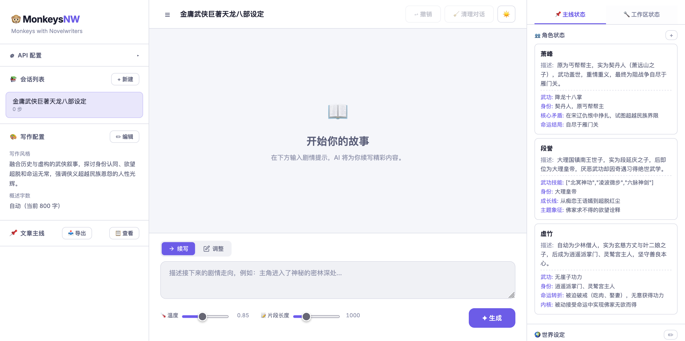
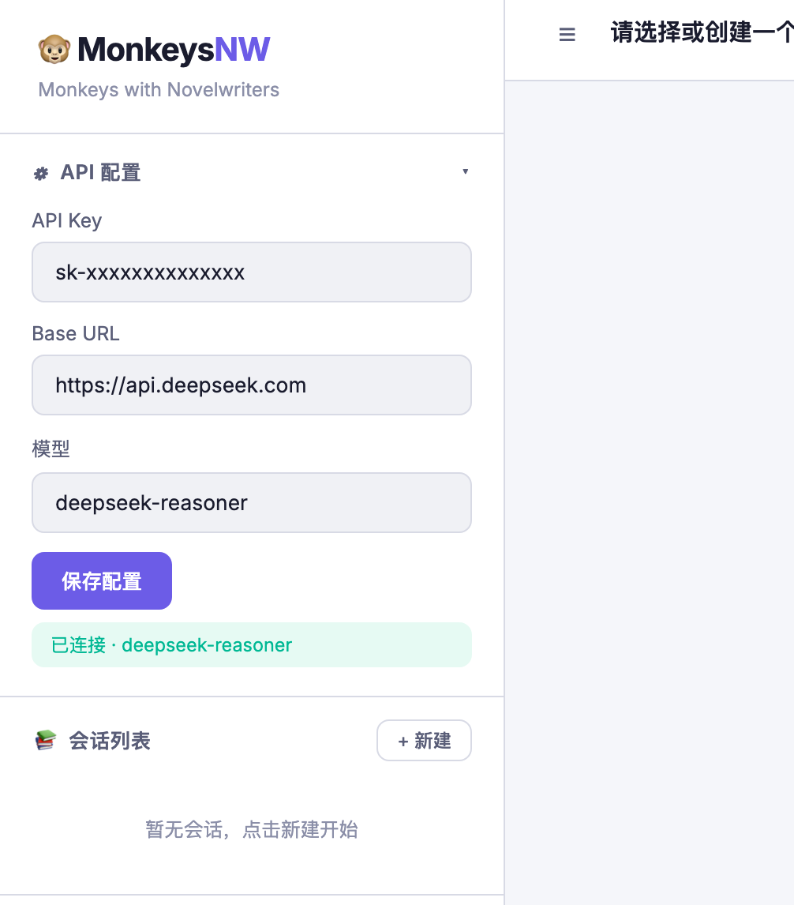
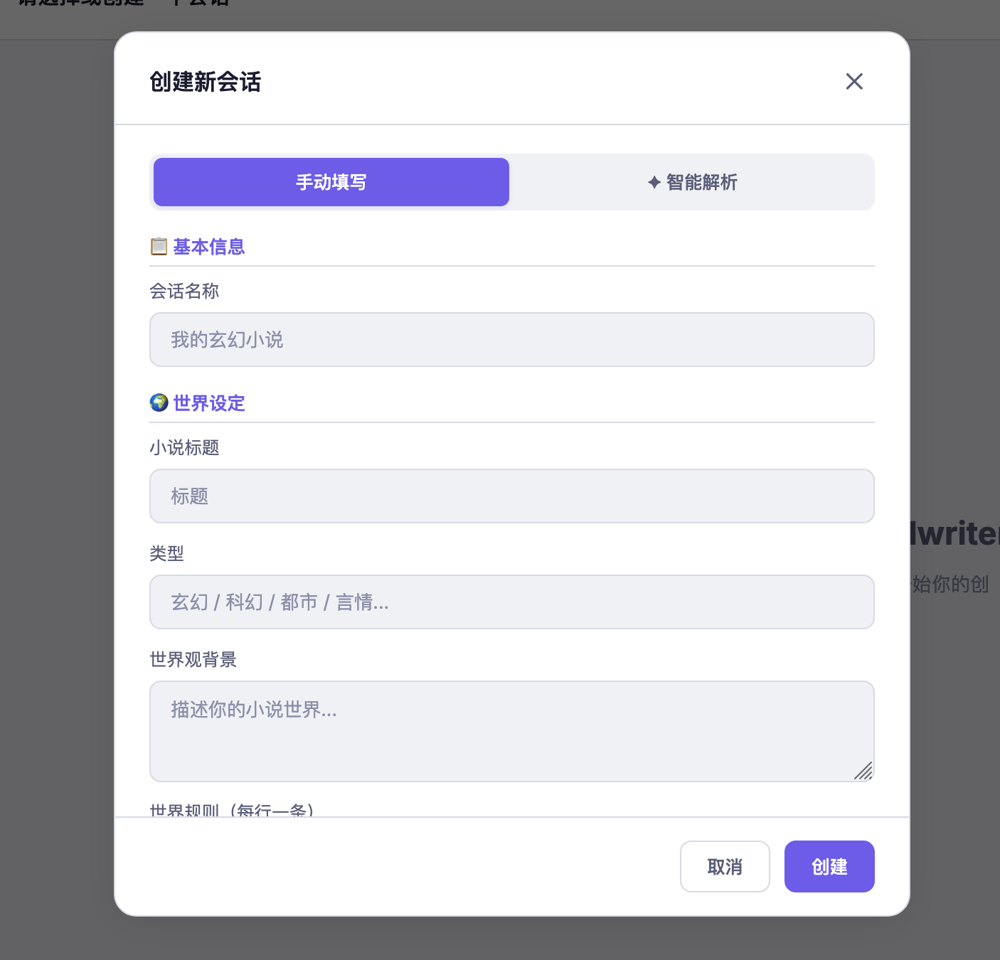
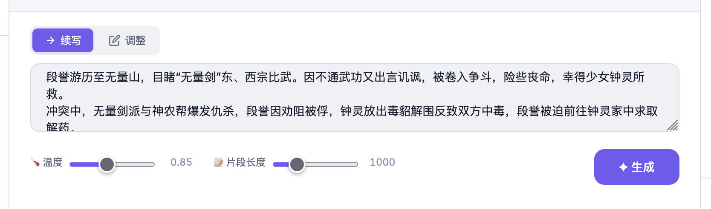
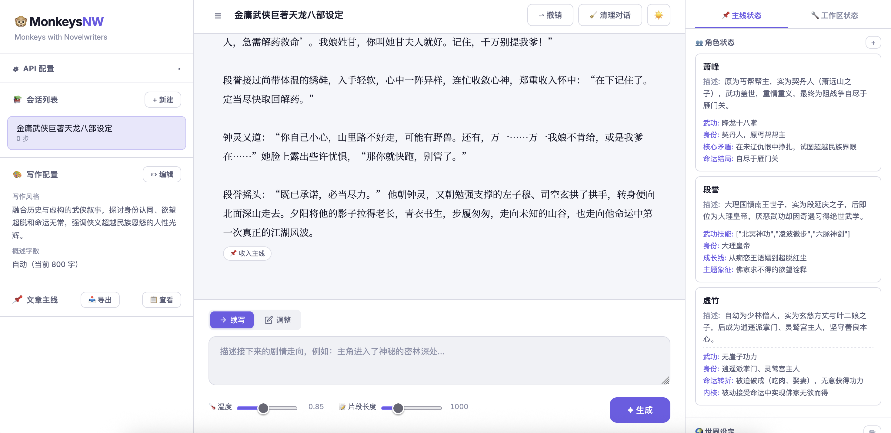
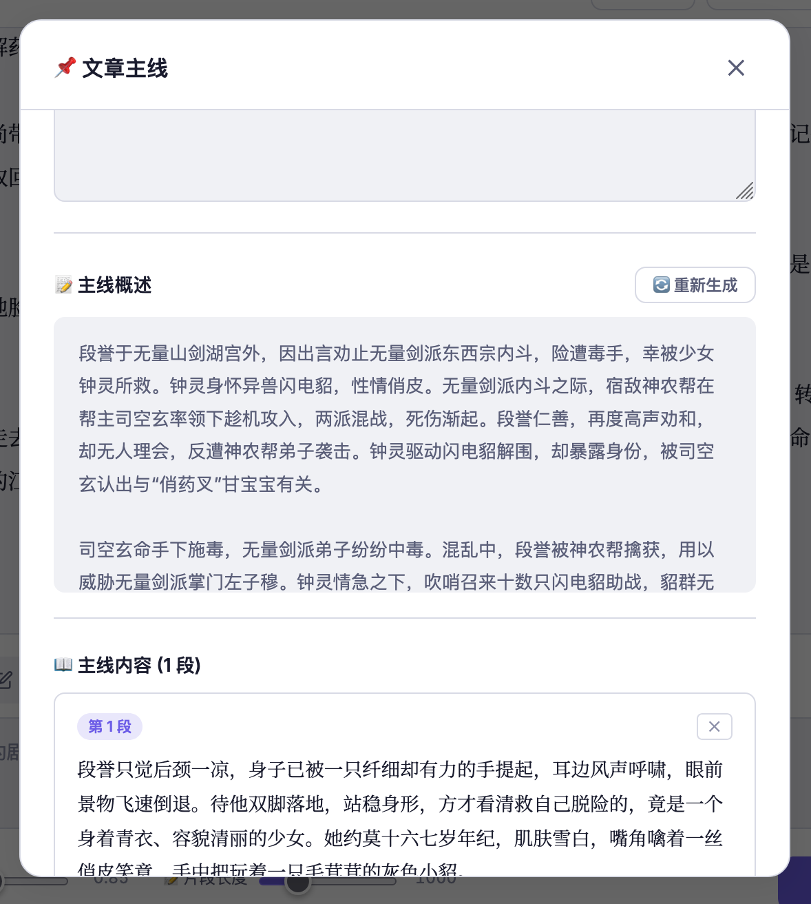
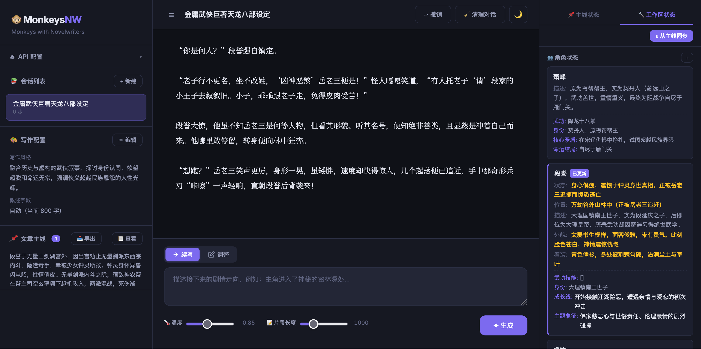

# 🐵 Monkeys-with-Novelwriters — AI 小说写作框架

<p align="center">
  <strong>基于大语言模型的交互式小说创作工具</strong>
</p>

<p align="center">
  <a href="#功能特性">功能特性</a> •
  <a href="#快速开始">快速开始</a> •
  <a href="#使用指南">使用指南</a> •
  <a href="#配置说明">配置说明</a> •
  <a href="#技术栈">技术栈</a> •
  <a href="#项目结构">项目结构</a>
</p>

---

Monkeys-with-Novelwriters 是一个开箱即用的 AI 小说写作框架。通过对话式交互引导大语言模型生成高质量的小说片段，同时自动维护角色状态、世界设定和地点信息的一致性。内置 Web UI，支持任何兼容 OpenAI API 格式的模型（DeepSeek、GPT-4o、Claude 等）。

<!-- 截图：主界面全貌，展示侧边栏 + 故事阅读区 + 右侧状态面板的三栏布局，需要有一个已加载会话的完整状态 -->


## 功能特性

### 🤖 智能续写与调整

- **续写模式**：根据剧情提示续写小说，输出连贯的故事片段
- **调整模式**：对最近一次生成不满意时，一键切换到调整模式重新生成
- 可调节**生成温度**和**片段长度**，精细控制输出风格
- 每次生成后自动更新角色状态（位置、情绪、关系、物品、自定义字段等）

### 📌 文章主线系统

- 从生成的片段中挑选满意的段落**收入主线**
- 主线条目支持**编辑**、**排序**、**删除**
- 自动生成**主线概述**作为 AI 的上文记忆，确保长篇写作的连贯性
- 概述字数支持**自动模式**（按主线总字数智能调整）和**手动模式**（指定 800-5000 字）
- **前情概述**：在新会话中手动插入之前章节的内容摘要，压缩历史上文长度，适用于超长篇写作的分卷管理
- 主线内容可**一键导出为 TXT** 文件

### 🌍 完善的世界观管理

- **世界设定**：标题、类型、世界观背景、世界规则、附加设定
- **角色管理**：姓名、外貌、着装、性格、当前状态、位置、关系、物品，以及**自定义字段**（修为、技能、等级等任意属性）
- **地点系统**：地点描述、父级地点、地点特征、地点连通关系
- **自定义字段定义**：会话级别定义角色需追踪的特殊属性，AI 自动为每个角色维护

### 📊 双层状态管理

- **主线状态**（📌）：收入主线时冻结的"正式"状态快照，代表已确认的角色/世界观状态
- **工作区状态**（🔧）：每次 AI 生成后实时更新的状态，用于探索性写作
- 两套状态独立管理，均可手动编辑角色、世界设定和地点
- 支持将主线状态**一键同步到工作区**

### ✦ 智能解析建会话

- 粘贴一段自由格式的设定文本，AI **自动提取**世界观、角色、地点等结构化信息，一键创建会话
- 也可手动逐字段填写世界设定、角色、写作配置

### 🔄 历史管理

- **撤销**：撤销最后一次生成，回退到上一步状态（角色/世界/地点全部回滚）
- **清理对话**：清除对话历史记录，保留设定和主线（适用于对话过长想重开续写）

### 🎨 现代 Web UI

- 三栏布局：侧边栏（API 配置 / 会话列表 / 写作配置 / 主线面板）+ 故事阅读区 + 状态面板
- 支持**亮色/暗色主题**切换
- 所有操作通过浏览器完成，无需额外客户端

## 快速开始

### 环境要求

- Python ≥ 3.11

### 安装与启动

```bash
# 克隆仓库
git clone https://github.com/steelonion/Monkeys-with-Novelwriters.git
cd monkeynw

# 安装依赖（推荐使用虚拟环境）
pip install -r requirements.txt

# 启动
python -m monkeynw

# 指定端口和地址
python -m monkeynw --host 0.0.0.0 --port 8000

# 启用调试模式（记录所有 AI 请求/响应到 log/ 目录）
python -m monkeynw --debug
```

启动后在浏览器中访问 **http://localhost:8000** 即可使用。

## 使用指南

### 1. 配置 API

首次使用需要在侧边栏的 **⚙ API 配置** 面板中填写：

| 参数 | 说明 | 示例 |
|------|------|------|
| API Key | 大模型 API 密钥 | `sk-...` |
| Base URL | API 端点地址 | `https://api.deepseek.com` |
| 模型 | 模型名称 | `deepseek-reasoner` / `gpt-4o` |

支持任何兼容 OpenAI API 格式的服务（OpenAI、DeepSeek、Moonshot、本地 Ollama 等）。

<!-- 截图：侧边栏 API 配置面板展开状态，三个输入框（API Key / Base URL / 模型）已填写，下方保存按钮可见 -->


### 2. 创建会话

点击侧边栏 **+ 新建** 按钮，有两种方式：

- **手动填写**：逐项填写世界设定（标题、类型、背景、规则）、写作配置（剧情弧、风格要求、概述字数）、自定义字段定义。
- **✦ 智能解析**：粘贴包含设定信息的文本，AI 自动提取所有结构化信息并创建会话。

<!-- 截图：新建会话弹窗 - 手动填写模式，展示基本信息、世界设定、写作配置、自定义字段等表单区域 -->


<!-- 截图：新建会话弹窗 - 智能解析模式，展示文本粘贴区域和「✦ 智能解析并创建」按钮 -->


### 3. 生成小说

在故事区底部输入剧情提示，点击 **✦ 生成**：

- **续写**（默认）：基于当前上下文续写新内容
- **调整**：替换最后一次生成的内容

可通过滑块调节**生成温度**（0-2，控制创造性）和**片段长度**（100-4000 字）。

<!-- 截图：底部输入区域，展示续写/调整模式切换按钮、输入框、温度和片段长度滑块、生成按钮 -->


每个生成的片段可点击 **📌 收入主线** 将其加入文章主线。

<!-- 截图：故事阅读区，展示多个已生成的小说片段，鼠标悬浮在某个片段上显示「📌 收入主线」按钮 -->


### 4. 管理主线

侧边栏 **📌 文章主线** 面板显示主线概述预览。点击 **📋 查看** 打开完整的主线管理弹窗：

- **📋 前情概述**：手动编辑之前章节的内容摘要（用于新会话压缩上文）
- **📝 主线概述**：AI 自动生成的主线内容摘要，支持手动重新生成
- **📖 主线内容**：查看 / 排序 / 删除所有主线条目
- **📥 导出**：将主线导出为 TXT 文件

<!-- 截图：主线管理弹窗完整视图，从上到下依次展示前情概述编辑区、主线概述区（含重新生成按钮）、主线条目列表（含排序/删除按钮） -->


### 5. 状态面板

右侧面板分为 **📌 主线状态** 和 **🔧 工作区状态** 两个标签页：

- **主线状态**：收入主线时的冻结快照，可手动编辑角色/世界设定/地点
- **工作区状态**：AI 生成后实时更新的状态，可手动编辑，支持 **⬇ 从主线同步**

<!-- 截图：右侧状态面板，展示「📌 主线状态」标签页下的角色卡片、世界设定和地点信息 -->


<!-- 截图：右侧状态面板，展示「🔧 工作区状态」标签页，顶部有「⬇ 从主线同步」按钮，下方为角色/世界/地点 -->


### 6. 其他操作

| 操作 | 说明 |
|------|------|
| ↩ 撤销 | 撤销最后一次生成，角色/世界/地点状态全部回滚 |
| 🧹 清理对话 | 清除对话历史，保留设定和主线 |
| 🌙 主题切换 | 右上角按钮，切换亮色/暗色主题 |

<!-- 截图：暗色主题下的主界面全貌，与开头的亮色主题形成对比 -->


## 配置说明

### 命令行参数

| 参数 | 说明 | 默认值 |
|------|------|--------|
| `--host` | 监听地址 | `0.0.0.0` |
| `--port` | 监听端口 | `8000` |
| `--debug` | 启用调试模式（记录 AI 请求/响应到 log/） | 关闭 |

### 运行时文件

| 路径 | 说明 |
|------|------|
| `config.json` | API 配置（密钥、端点、模型），启动时自动加载 |
| `sessions/` | 会话数据持久化存储（JSON 格式） |
| `exports/` | 主线导出的 TXT 文件 |
| `log/` | 调试模式下的 AI 请求/响应日志 |

> ⚠️ `config.json` 包含 API 密钥，请勿提交到公开仓库。

## 技术栈

| 组件 | 技术 |
|------|------|
| 后端 | Python / FastAPI / Uvicorn |
| AI 接口 | OpenAI Python SDK（兼容格式） |
| 数据模型 | Pydantic v2 |
| 前端 | 原生 HTML / CSS / JavaScript（无框架依赖） |
| 持久化 | JSON 文件存储 |

## 项目结构

```
monkeynw/
├── pyproject.toml
├── requirements.txt
├── config.json             # 运行时生成
├── sessions/               # 会话数据
├── exports/                # 导出文件
├── log/                    # 调试日志
└── src/monkeynw/
    ├── __init__.py
    ├── __main__.py          # CLI 入口
    ├── main.py              # FastAPI 路由
    ├── ai_service.py        # AI 服务（提示词构建 / API 调用 / 输出解析）
    ├── models.py            # Pydantic 数据模型
    ├── session_manager.py   # 会话管理（CRUD / 撤销 / 主线 / 导出）
    └── frontend/
        ├── index.html
        ├── css/
        └── js/
```

## 许可证

本项目基于 [GPL-3.0](LICENSE) 许可证开源。
